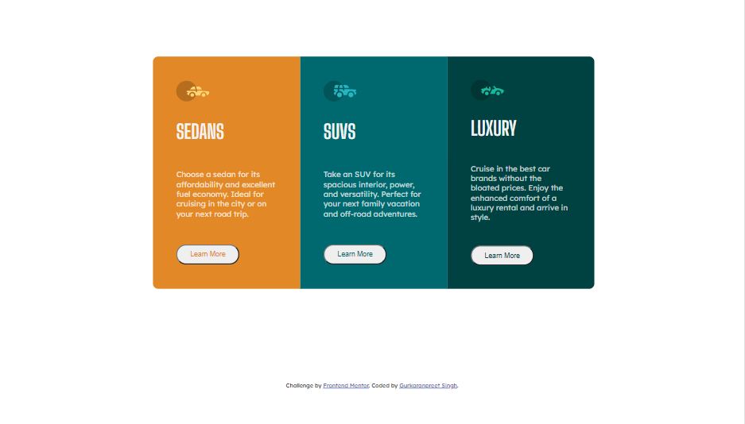
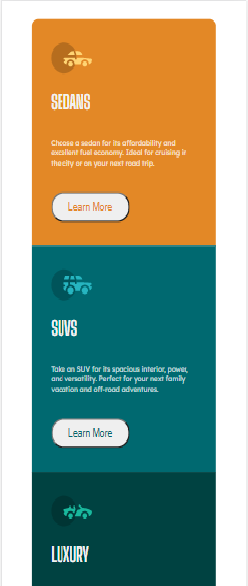

# Frontend Mentor - 3-column preview card component solution

This is a solution to the [3-column preview card component challenge on Frontend Mentor](https://www.frontendmentor.io/challenges/3column-preview-card-component-pH92eAR2-). Frontend Mentor challenges help you improve your coding skills by building realistic projects. 

## Table of contents

- [Overview](#overview)
  - [The challenge](#the-challenge)
  - [Screenshot](#screenshot)
  - [Links](#links)
- [My process](#my-process)
  - [Built with](#built-with)
  - [What I learned](#what-i-learned)
  - [Continued development](#continued-development)
  - [Useful resources](#useful-resources)
- [Author](#author)

## Overview

### The challenge

Users should be able to:

- View the optimal layout depending on their device's screen size
- See hover states for interactive elements

### Screenshot
Desktop version (width:1440px)

Mobile version(width:375px)

### Links

- Solution URL: [Add solution URL here](https://github.com/gurkaran321/3-column-preview-card-componet)
- Live Site URL: [Add live site URL here](https://gurkaran321.github.io/3-column-preview-card-componet/)

## My process

### Built with

- Semantic HTML5 markup
- CSS custom properties
- Flexbox
- CSS Grid
- Mobile-first workflow

### What I learned
1. Using Grid to create 3 columns in desktop version and single column in mobile version.
2. Used Flexbox to set content of each column.
3. Used rem for font-sizing which made easy to change font size.

### Continued development

I want to refine my styling of buttons, it is not upto mark which I will try to do better in future projects.

### Useful resources

- [MDN Webdocs](https://developer.mozilla.org/en-US/) - This helped me to refine my CSS concepts.

## Author

- Github - [@gurkaran321](https://github.com/gurkaran321)
- Frontend Mentor - [@gurkaran321](https://www.frontendmentor.io/profile/gurkaran321)
- Twitter - [@Gurkara91852908](https://twitter.com/Gurkara91852908)

